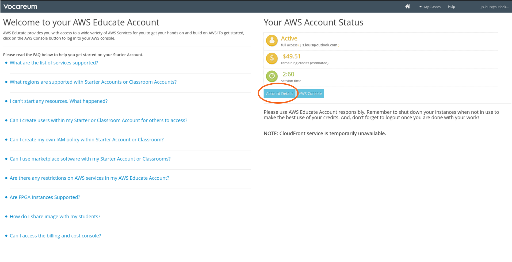

# Getting Started

Before you can create resources in AWS you will first need to configure your local environment. 

Note that the EB CLI requires Python to be installed on your system.

### AWS Authentication Keys

1) Login into your AWS Educate account and select "AWS Account" on the top right


2) Select "AWS Educate Starter Account" which should open a new tab




3) Select the "Account Details" button and you will be presented with 


4) Using your favorite editor copy the entire contents of the "AWS CLI" section to the `~/.aws/credentials` file on Mac/Linux and `%UserProfile%\.aws\credentials` on Windows.
More information can be found in the [CLI Configuration Docs](https://docs.aws.amazon.com/cli/latest/userguide/cli-configure-files.html)

<br>
<br>
Now that your API credentials are saved, you will be able to authenticate against your AWS account using CLI tools as well as programs that use the AWS SDK. Note that AWS Educate tokens expire after 3 hours, so please repeat these steps if you receive an expired session error.
<br>
<br>

### Install and Configure the EB CLI
EB ClI - See installation [instructions](https://docs.aws.amazon.com/elasticbeanstalk/latest/dg/eb-cli3-install-advanced.html) for your OS

Once installed check that the CLI is installed by running:

```
eb --version
EB CLI 3.19.3 (Python 3.8.5)
```
